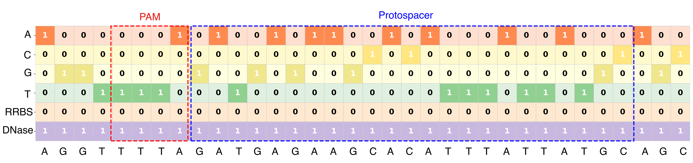

# DeepCas12a：A Deep Learning Model for Cas12a Targeting Efficiency Predicting
## Introduction
This repository hosts a novel classification model designed to predict the targeting efficiency of Cas12a (formerly Cpf1) guide RNAs. Accurately predicting on-target efficacy is crucial for maximizing the success of CRISPR-Cas12a based genome editing experiments. Our model leverages deep learning techniques to identify gRNAs that are likely to be highly effective, thereby saving time and resources in experimental workflows.
## Model input
1. Sequence:34 bp synthetic target and target context sequence（4 bp + PAM + 23 bp protospacer + 3 bp）
2. Epigenetic information: chromatin accessibility and DNA methylation status. For chromatin accessibility features, a site is labeled "A" if it is chromatin accessible and "N" otherwise. For methylation features, a site is labeled as "A" if it is methylated and "N" if it is unmethylated.
### Data Encoding
We encode the input data as an image for deep learning training:

## Installation
1. Clone the Repository
```
git clone https://github.com/bm2-lab/Cas12a-CViT.git
cd Cas12a-CViT
```
2. Install Dependencies
```
# Ensure you have Python 3.8+ installed, then run:
pip install numpy pandas torch scikit-learn scipy
```
## Usage
Quick start with three simple steps:

### Step 1: Encode
Load and encode your sequences from a tab-separated file (see `example/example_sequences.txt` for format).
```python
import torch
from DeepCas12a import Episgt

data = Episgt('data path', num_epi_features=2, with_y=True)
X, y = data.get_dataset()
X = torch.tensor(X).unsqueeze(1)
```

### Step 2: Load Model
Load a pre-trained model from trained checkpoints.
```python
from DeepCas12a import VisionTransformer

model = VisionTransformer()
model.load_state_dict(torch.load('model path'))
model.eval()
```

### Step 3: Perform Prediction
Get predictions (0 or 1) for targeting efficiency.
```python
with torch.no_grad():
    predictions = model(X)
```

For a complete example, see `run_example.py`.
## License
This project is licensed under the Apache License. See LICENSE for details.
## Contact
For questions or collaborations, please contact 2251829@tongji.edu.cn or open an issue on GitHub.
